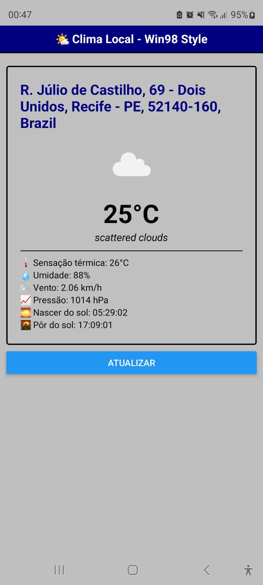
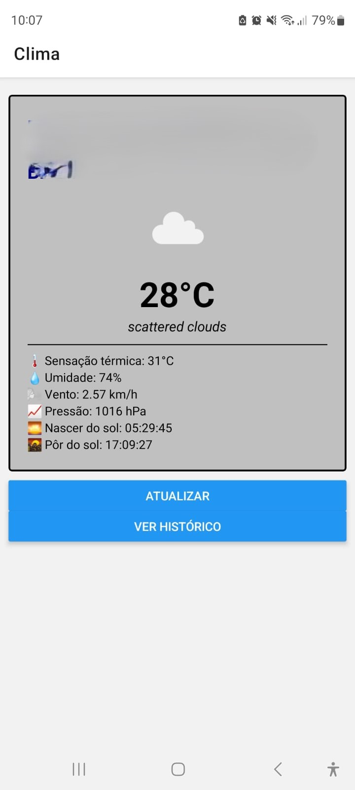
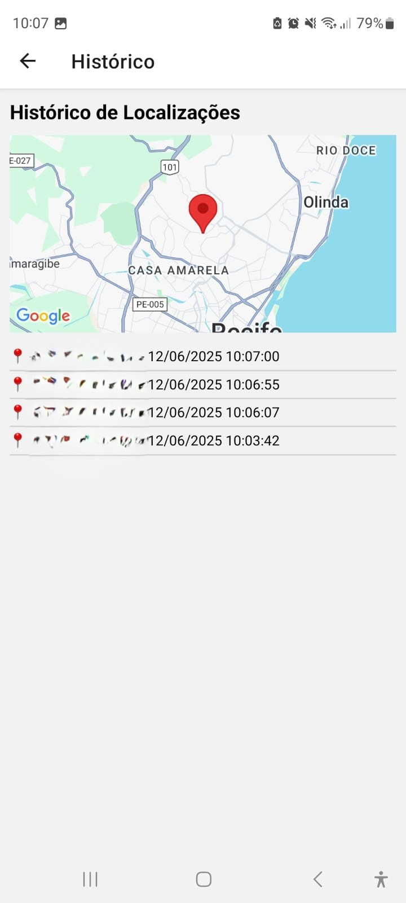

# Clima Local

**Clima Local** é um aplicativo mobile cross-platform (React Native + Expo) com backend em Node.js que exibe informações meteorológicas em tempo real usando OpenWeatherMap e Google Maps, além de registrar o histórico de locais visitados pelo usuário em um banco de dados MongoDB Atlas.

---

## 📌 Recursos Principais

* **Tela Inicial** (Home)

  * Detecta e usa a localização atual do usuário.
  * Exibe dados meteorológicos atuais: temperatura, sensação térmica, umidade, vento, pressão, nascer/pôr do sol.
  * Exibe previsão para os próximos 5 dias em cards horizontais.
  * Botões para atualizar dados e acessar o histórico de locais.

* **Histórico de Localizações** (History)

  * Mapa interativo com `react-native-maps`, marcadores e polilinha representando o trajeto.
  * Lista de coordenadas (latitude, longitude) com timestamp.

* **API Backend**

  * **GET** `/weather?city=CityName` – Obter clima por nome de cidade.
  * **GET** `/weather/coords?lat={lat}&lon={lon}` – Obter clima por coordenadas e endereço formatado (reverse geocoding).
  * **POST** `/location/save` – Salvar coordenada no MongoDB.
  * **GET** `/location/history` – Retornar todas as localizações salvas, ordenadas por data decrescente.

---

## 🛠️ Tecnologias

* **Frontend**

  * React Native + Expo SDK 53
  * react-native-maps (MapView, Marker, Polyline)
  * AsyncStorage para cache local
  * React Navigation (native-stack)

* **Backend**

  * Node.js + Express
  * MongoDB Atlas (mongoose)
  * Axios para chamadas HTTP (OpenWeatherMap, Google Geocode)
  * CORS, dotenv

* **APIs**

  * [OpenWeatherMap](https://openweathermap.org/api)
  * [Google Maps Geocoding API](https://developers.google.com/maps/documentation/geocoding)

---

## 🚀 Pré-requisitos

* Node.js (v14+)
* npm ou yarn
* Conta no MongoDB Atlas
* Chaves de API:

  * **OWM\_API\_KEY** – OpenWeatherMap
  * **GMAPS\_API\_KEY** – Google Geocoding

---

## 🔧 Configuração do Backend

1. Clone o repositório e acesse a pasta do backend:

   ```bash
   git clone <repo-url>
   cd Backend-Clima-Local
   ```

2. Instale as dependências:

   ```bash
   npm install
   # ou yarn install
   ```

3. Crie um arquivo `.env` na raiz do backend contendo:

   ```env
   MONGO_URI="<sua-mongodb-uri>"
   OWM_API_KEY="<sua-openweather-key>"
   GMAPS_API_KEY="<sua-google-maps-key>"
   ```

4. Inicie o servidor:

   ```bash
   npm run dev
   # ou
   node index.js
   ```

5. O servidor estará disponível em `https://backend-clima-local.onrender.com`.

---

## 🔧 Configuração do Frontend

1. Acesse a pasta do projeto React Native:

   ```bash
   cd App-Expo
   ```

2. Instale as dependências:

   ```bash
   npm install
   # ou yarn install
   ```

3. Opcional: configure o endpoint do backend se não estiver usando o padrão `https://backend-clima-local.onrender.com` 修改 `BASE_URL` em `utils/api.js`:

   ```js
   const BASE_URL = 'https://seu-backend-url.com';
   ```

4. Inicie o Expo:

   ```bash
   expo start
   ```

5. Abra no dispositivo ou emulador via QR code.

---

## ⚙️ Estrutura de Pastas

```
Backend-Clima-Local/
├── controllers/
│   ├── locationController.js
│   └── weatherController.js
├── models/
│   └── Location.js
├── routes/
│   ├── location.js
│   └── weather.js
├── .env
└── index.js

App-Expo/
├── assets/
│   ├── adaptive-icon.png
│   ├── favicon.png
│   ├── icon.png
│   └── splash.png
├── components/
│   ├── ForecastItem.js
│   ├── RetroCard.js
│   └── WeatherCard.js
├── screens/
│   ├── HomeScreen.js
│   └── HistoryScreen.js
├── utils/
│   ├── api.js
│   └── storage.js
├── App.js
└── app.json
```

---

## 📖 Uso

* Na tela inicial, permita o acesso à localização.
* O app salva automaticamente a última localização no AsyncStorage e no MongoDB.
* Navegue para "Histórico" para ver seu trajeto.
* Atualize manualmente clicando em "Atualizar".

---

## 📜 API Reference

### Weather

* **GET** `/weather?city=CityName`

  * Parâmetros de query:

    * `city` (string, obrigatório)
  * Resposta: objeto JSON com dados atuais do clima.

* **GET** `/weather/coords?lat={lat}&lon={lon}`

  * Parâmetros de query:

    * `lat`, `lon` (números, obrigatórios)
  * Resposta: `{ location: string, weather: object }`.

### Location

* **POST** `/location/save`

  * Body JSON: `{ lat: Number, lon: Number }`
  * Salva coordenada no MongoDB.

* **GET** `/location/history`

  * Retorna array de objetos `{ lat, lon, timestamp }`, ordenado por `timestamp` decrescente.

---







## 🤝 Contribuição

Contribuições são bem-vindas! Faça um fork do projeto, crie uma branch com sua feature (`git checkout -b feature/fooBar`), commit (`git commit -m 'Add fooBar'`), e abra um Pull Request.

---

## 📄 Licença

MIT © \ Felippe Adriel
